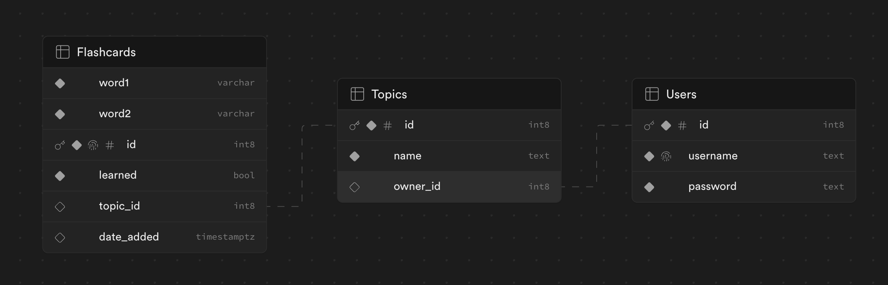

# SSE Group Project: Flashcards Website

## Overall Structure
The web application is an English-Spanish language learning platform. It allows users to manage flashcard sets, generate new entries, and revise vocabulary through custom study sessions. The platform uses Supabase for flashcard storage and OpenAI for generating new flashcards based on topics. Users can also manually add new entries to their flashcard sets.

## Components
**User Management:** Handles user registration, login, and logout using a custom user loader and login manager.

**Flashcard Management:** Adds, manages, and displays flashcard sets using Supabase for storage and retrieval.

**Flashcard Generation:** Generates 5 new flashcards using OpenAI's API based on a user's input topic. It ensures no duplicates are created and allows manual input of flashcards into sets.

**Study Session:** Offers a study mode where users select a set to study. The app presents a word and 4 possible answers, updating the entry as “Learned” in Supabase if the correct answer is chosen.

## Data Flow
1. **User Interaction:** Users perform actions like registering, logging in, adding words, generating flashcards, and participating in study sessions.
2. **Front-end Communication:** The front-end communicates with the Flask application via HTTP requests.
3. **Business Logic Execution:** The Flask application processes requests and executes business logic.
4. **Database Interaction:** Interaction with Supabase for storing, retrieving, and updating data.
5. **API Interaction:** For flashcard generation, the Flask application interacts with OpenAI's API.

## How to use the app online
1. Go to [our website]([URL](https://flash-cards-kappa.vercel.app/))
2. Sign up / in and use the app

## How to run the app locally
1. Clone the repository
2. Install dependencies using `pip install -r "requirements.txt"`
3. Set up your own database on Supabase using this structure:
   
*Supabase Database Structure*
4. Get an OpenAI API key
5. Add your Supabase credentials and OpenAI API key as environment variables
6. Run the code from the `./api` folder: `flask run`
